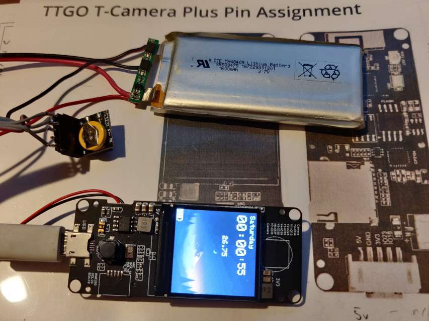

# TTGO-ESP32-T-display-smart-watch

This version adapted to used TTGO T-Camera Plus board.

Has raspi DS3231 rtc module connected to ttgo grove connector.

Includes modified board definition file with altered I2C pins to suit.

Changes to bitmaps to suit 240x240 display

Minor changes to display layout to use additional space.

Buttons not yet implemented, plan is to remove camera and use released pins.

todo: utilise charge monitor device built into board.
